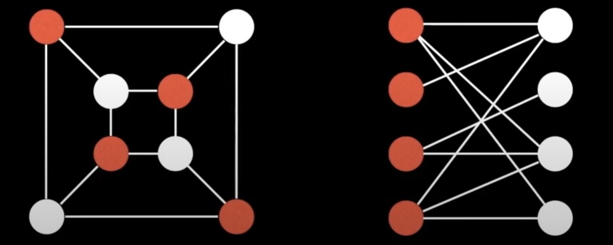

# data-structure

## Content
1. [Definition of Graph Theory](#graph)
2. [Types of Graphs](#types-of-graphs)
3. [Special Graphs](#special-graphs)
4. [Representing Graphs](#representing-graphs)
5. [Common Graph Theory Problems](#common-graph-theory-problems)

## Graph
Graph theory is the mathematical theory of the properties and applications
of graphs (networks).

### Types of Graphs
1. Undirected Graph
...edges have no orientation.

2. Directed Graph
...edges have orientation.

3. Weighted Graphs
...edges can have certain weights to represent an arbitrary value such as cost, distance, quantity, etc...

### Special Graphs
Below are only a few special graphs, there are more than these.
1. Trees
...undirected graph with no cycles. It is a connected graph with N nodes and N-1 edges.

2. Rooted Trees
It is a tree with a designated root node where every edges points away from or
towards the root node. Points away called arborescence (out-tree), otherwise it is called anti-arborescence (in-tree).

3. Directed Acyclic Graphs (DAGs)
- directed graphs with no cycles.
- important in representing structures with dependencies(Scheduler, Bill System...).
- several efficient algorithms exist to operate on DAGs.
- all out-trees are DAGs, but not all DAGs are out-tree.

4. Bipartite Graph
- vertices can be split into two groups U, V such that every edge connects between U and V.
- the graph is a two colorable or there is no odd length cycle.

5. Complete Graphs
- there is a unique edge between every pair of nodes.
- a complete graph with n vertices is denoted as the graph Kn.
- often seen as worse case possible graph.

### Representing Graphs

#### Adjacency Matrix   
Adjacency matrix m is used to represent graphs.
- the cell m[i][j] represents the edge weight of going from node i to node j.
- it is often assumed that the edge of going from a node to itself has a cost of zero.

*Pros*
- Space efficient for representing dense graphs. 
- Edge weight lookup is O(1).
- Simplest graph representation.

*Cons*
- Requires O(V^2)
- Iterating over all edges takes O(V^2) time

[wiki - adjacency matrix](https://en.wikipedia.org/wiki/Adjacency_matrix)

#### Adjacency List
- a way to represent a graph as a map from nodes to lists of edges.

*Pros*
- Space efficient for representing parse graphs.
- Iterating over all edges is efficient.

*Cons*
- Less space efficient for denser graphs.
- Edge weight lookup is O(E).
- Slightly more complex graph representation.

[wiki - adjacency list](https://en.wikipedia.org/wiki/Adjacency_list)

#### Edge List
- is a way to represent a graph as an unordered list of edges.
- the triplet (u, v, w) means: the cost from node u to bode v is w.
- it is seldomly used because of its lack of structure.
- it is conceptually simple and practical in a handful of algorithms.

*Pros*
- Space efficient for representing parse graphs.
- Iterating over all edges is efficient.
- very simple structure.

*Cons*
- Less space efficient for denser graphs.
- Edge weight lookup is O(E).

[wiki - edge list](https://en.wikipedia.org/wiki/Edge_list)

### Common Graph Theory Problems
<a id="top" href="#top">[Back to Top](#top)</a>
... directed or undirected?

... are edges weighted?

... is the graph sparse or dense with the edges?

... should I use an adjacency matrix, adjacency list, and edge list or other structure to represent the graph efficiently?

#### Shortest Path Problem
Given a weighted graph, find the shortest path of edges from node A to node B.

Algorithms: BFS(unweighted graph), Dijkstra's, Bellman-Ford, Floyd-Warshall, A*, and many more.

#### Connectivity
Does there exist a path between node A and node B?

Solution: Use **union find** data structure or any search algorithm (e.d DFS)

#### Negative Cycles
